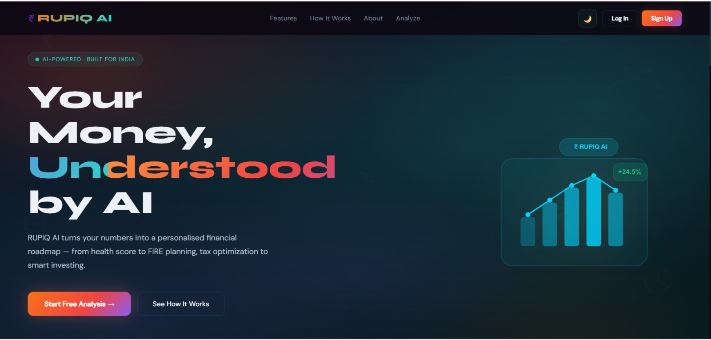
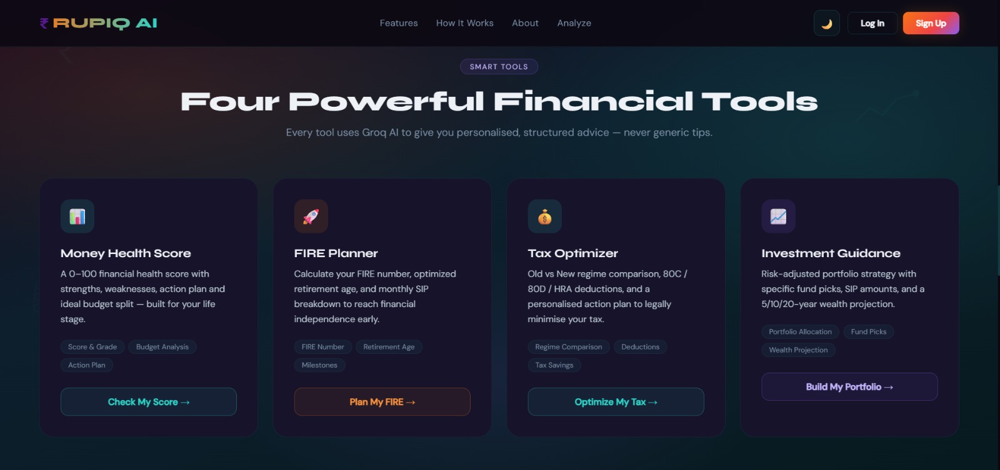
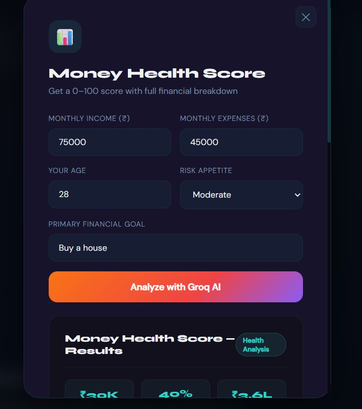
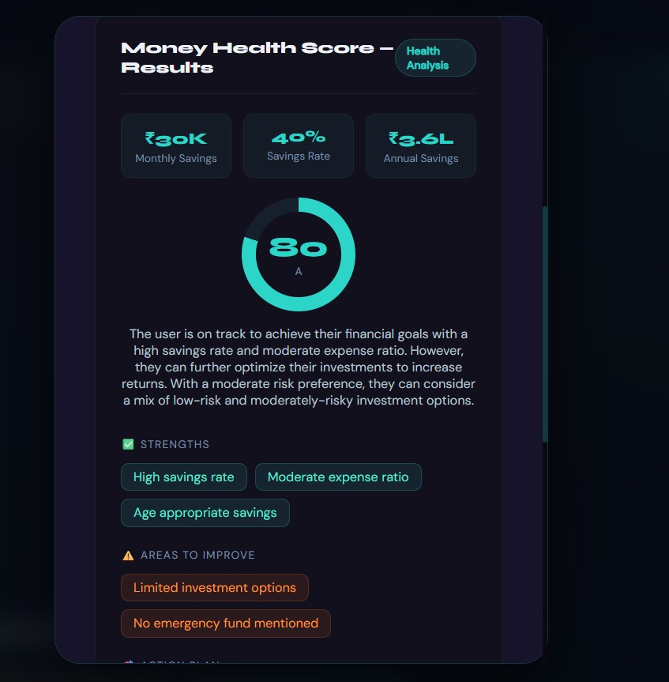
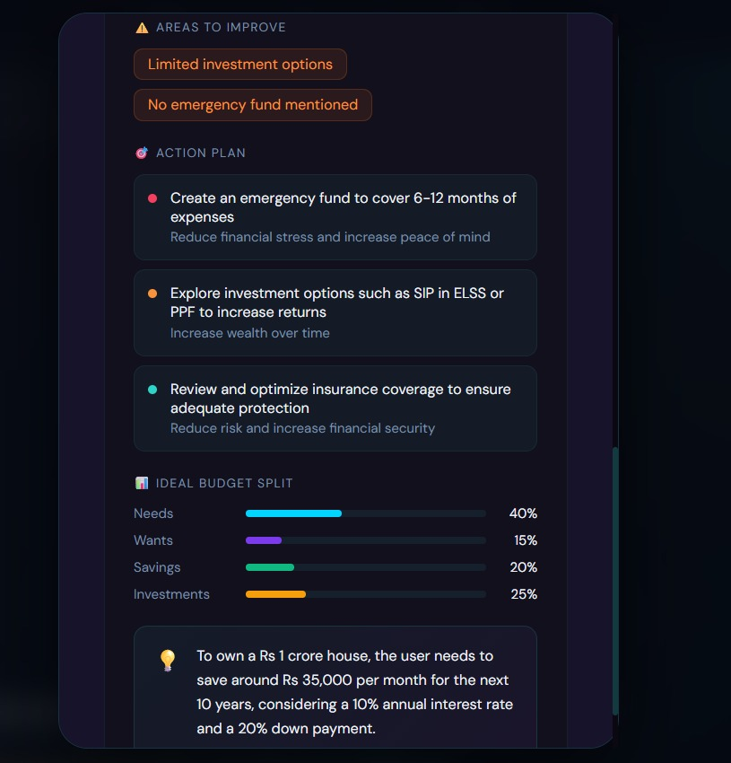

# 💰 RUPIQ AI — Your AI Financial Advisor

> AI-powered financial planning built for India. From health score to FIRE planning, tax optimization to smart investing.

🌐 **Live Demo:** [rupiq-ai.vercel.app](https://rupiq-ai.vercel.app/)

---

## ❓ Problem

Most Indians lack access to personalised financial advice. Generic calculators give one-size-fits-all answers, financial advisors are expensive, and existing apps don't account for India-specific factors like 80C deductions, PPF, NPS, or the old vs new tax regime. First-time earners and young professionals are left guessing about savings, investments, and retirement.

## ✅ Solution

RUPIQ AI brings a personal financial advisor to everyone — for free. By combining **Groq AI** with Indian financial context, it analyses your real numbers and delivers a personalised action plan in seconds. No jargon, no generic tips — just clear, structured guidance built specifically for India.

---

## 📸 Screenshots

### 🏠 Landing Page

*"Your Money, Understood by AI" — hero section with dark teal aesthetic*

### 🧰 Four Financial Tools

*Every tool uses Groq AI to give personalised, structured advice — never generic tips*

### 🔐 Authentication

*Clean sign-up flow with email/password via Supabase*

### 🏥 Money Health Score — Input

*Enter income, expenses, age, risk appetite and financial goal*

### 📊 Money Health Score — Results

*Score of 80/A with strengths, areas to improve, and ideal budget split*

### 📋 Action Plan & Budget Split

*Prioritised action items with ideal 40/15/20/25 budget split across Needs, Wants, Savings & Investments*

---

## 🚀 Quick Start

### 1. Install Dependencies

```bash
npm install
```

### 2. Run Development Server

```bash
npm run dev
```

The app will open at **http://localhost:5173**

### 3. Build for Production

```bash
npm run build
```

---

## ✨ Features — 4 AI-Powered Financial Tools

| Tool | Description |
|------|-------------|
| 🏥 **Money Health Score** | Get a 0–100 financial health score with a personalized action plan |
| 🔥 **FIRE Planner** | Calculate your Financial Independence, Retire Early roadmap |
| 📊 **Tax Optimizer** | Maximize tax savings using Indian tax laws |
| 📈 **Investment Guidance** | Get custom portfolio strategies with specific fund recommendations |

---

## 🛠️ Tech Stack

| Layer | Technology |
|-------|-----------|
| **Frontend** | Vanilla JavaScript (ES6+), HTML5, CSS3 |
| **AI** | GROQ — Llama 3.1-8b-instant model |
| **Database** | Supabase (PostgreSQL) |
| **Auth** | Supabase Authentication |
| **Build** | Vite |
| **Styling** | Custom CSS with CSS Variables (Dark/Light theme) |

---

## 📁 Project Structure

```
rupiq-ai/
├── index.html
├── src/
│   ├── script.js
│   ├── style.css
│   └── supabase.js
├── .env
└── supabase/
    └── migrations/
```

---

## 🔐 Environment Variables

Already configured in `.env`:

```env
VITE_SUPABASE_URL=       # Your Supabase project URL
VITE_SUPABASE_ANON_KEY=  # Your Supabase anonymous key
```

---

## 🗄️ Database

The app uses **Supabase** with two main tables:

- **`financial_profiles`** — Stores user financial data
- **`ai_reports`** — Stores AI-generated reports

> Row Level Security (RLS) is enabled on all tables to ensure users can only access their own data.

---

## 🔑 Authentication

- Email/password authentication via Supabase
- Session persistence across page reloads
- Secure user management

---

## 📖 How to Use

1. **Sign Up** — Create a free account
2. **Choose a Tool** — Select from 4 financial tools
3. **Enter Your Data** — Income, expenses, age, and goals
4. **Get AI Analysis** — Receive personalized financial advice
5. **Take Action** — Follow the actionable recommendations

---

## 🧑‍💻 Development

### Available Scripts

```bash
npm run dev      # Start development server
npm run build    # Build for production
npm run preview  # Preview production build
npm run lint     # Run ESLint
```

### Code Organization

| File | Purpose |
|------|---------|
| `src/style.css` | All styling and theming |
| `src/script.js` | Core application logic |
| `src/supabase.js` | Supabase client & helpers |
| `index.html` | App entry point |

---

## ⚠️ Security Notes

- GROQ API key is currently in the frontend *(demo purpose only)*
- Move AI calls to a backend server in production
- Supabase handles authentication and database security
- Row Level Security ensures users can only access their own data

---

## 🇮🇳 Indian Financial Context

This app is built specifically for Indian users and includes:

- FY 2024–25 tax slabs
- Deductions: 80C, 80D, HRA
- Investment options: PPF, NPS, ELSS, SGB
- SIP-based investing strategies
- FIRE calculations using the **4% rule**

---

## 🌐 Browser Support

- ✅ Chrome, Firefox, Safari, Edge (modern versions)
- ✅ Requires ES6+ JavaScript
- ✅ Supports CSS Grid & Flexbox

---

## 📄 License

This project is created for educational and personal finance planning purposes.

> **Disclaimer:** Not SEBI-registered financial advice. For informational purposes only.

---

<p align="center">
  Built with <strong>GROQ AI</strong> &amp; <strong>Supabase</strong> • Designed for India 🇮🇳
</p>
